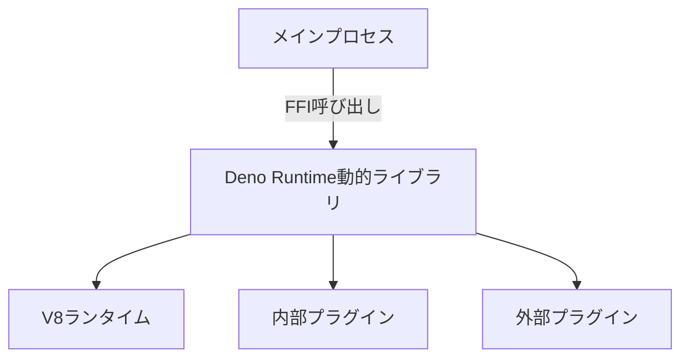
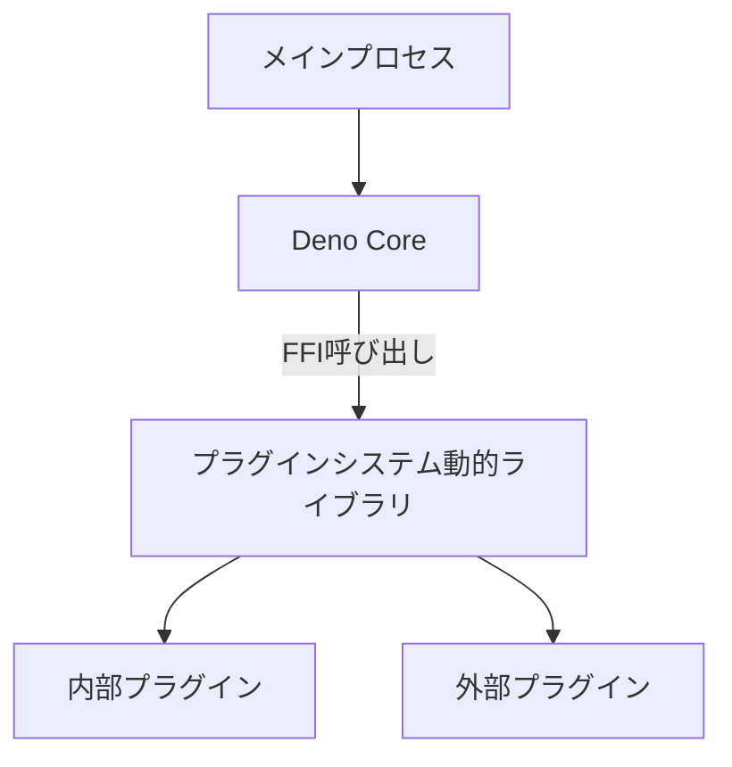
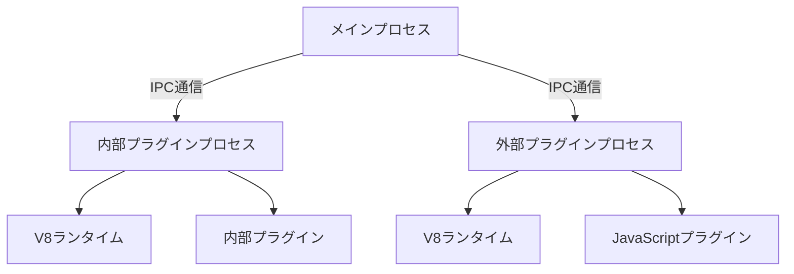

# Deno_runtimeの外部バイナリ分離と動的リンクに関する包括的最終レポート

**作成日**: 2026年1月21日  
**バージョン**: 1.0  
**プロジェクト**: Sapphillon

---

## はじめに

### 調査の目的と背景

Sapphillonプロジェクトでは、Deno Runtime（Deno Core）を使用してJavaScriptプラグインシステムを実装しています。現在、内部プラグインはメインプロセス内でDeno Runtimeと静的にリンクされて実行されていますが、外部プラグインは独立したプロセスとして実行されています。

本調査の目的は、Deno Runtimeを外部バイナリに分離して動的リンク（Dynamic Linking）することの技術的実現可能性を評価し、最適なアーキテクチャを提案することです。動的リンクにより、以下のメリットが期待されています：

- モジュール性の向上
- バイナリサイズの削減
- プラグインの独立した更新
- セキュリティの強化

### 調査の範囲

本調査は以下の範囲で実施されました：

1. Rustにおける動的リンクの可能性と技術的制約
2. Deno Coreの`#[op2]`マクロと動的リンクの互換性
3. OpStateのライフサイクルと管理
4. V8ランタイムの初期化と共有
5. 複数のアーキテクチャオプションの評価
6. 各オプションのメリット、デメリット、実装コストの分析

---

## プロジェクトの概要

### プロジェクトの構造

Sapphillonは、gRPCベースのワークフロー自動化プラットフォームであり、以下の構造を持っています：

```
Sapphillon/
├── src/                    # メインアプリケーション
│   ├── main.rs            # エントリーポイント
│   ├── server.rs          # gRPCサーバー
│   ├── init.rs            # システム初期化
│   ├── ext_plugin_manager.rs  # 外部プラグイン管理
│   ├── plugin_installer.rs    # プラグインインストーラー
│   └── services/          # gRPCサービス実装
├── plugins/               # 内部プラグイン
│   ├── exec/             # シェルコマンド実行
│   ├── fetch/            # HTTPリクエスト
│   ├── filesystem/       # ファイルシステム操作
│   ├── search/           # ファイル検索
│   └── window/           # ウィンドウ操作
├── database/             # データベース操作
├── entity/               # データベースエンティティ
├── migration/            # データベースマイグレーション
└── docs/                 # ドキュメント
```

**主要な依存関係**:

```toml
[dependencies]
deno_core = "0.363.0"
sapphillon_core = { git = "ssh://git@github.com/Sapphillon/Sapphillon-Core.git", tag = "v0.14.0" }
```

### Deno_runtimeの使用状況

Deno Runtimeは、Sapphillonプロジェクトで以下の2つの方法で使用されています：

#### 1. 内部プラグインでの使用

内部プラグイン（exec、fetch、filesystem、search、window）は、Rustで実装され、`#[op2]`マクロを使用してJavaScriptから呼び出せるようにしています。

**例: execプラグイン** ([`plugins/exec/src/lib.rs`](plugins/exec/src/lib.rs:74))

```rust
#[op2]
#[string]
fn op2_exec(
    state: &mut OpState,
    #[string] command: String,
) -> std::result::Result<String, JsErrorBox> {
    ensure_permission(
        state,
        &exec_plugin_function().function_id,
        exec_plugin_permissions(),
        &command,
    )?;

    match exec(&command) {
        Ok(output) => Ok(output),
        Err(e) => Err(JsErrorBox::new("Error", e.to_string())),
    }
}
```

**特徴**:
- `#[op2]`マクロを使用してRust関数をJavaScriptから呼び出し可能に
- `OpState`を通じてワークフローデータを共有
- 静的にリンクされ、メインプロセス内で実行

#### 2. 外部プラグインでの使用

外部プラグインは、JavaScriptで実装され、独立したプロセスとして実行されます。

**例: 外部プラグインサーバーの起動** ([`src/main.rs`](src/main.rs:119))

```rust
Command::Ext { server_name } => {
    info!("Starting External Plugin Server {server_name}...");
    use sapphillon_core::ext_plugin::extplugin_server;
    extplugin_server(&server_name)?;
}
```

**特徴**:
- 独立したプロセスとして実行
- IPC通信を使用してメインプロセスと通信
- V8ランタイムを外部プロセス内で初期化

### プラグインシステムの概要

Sapphillonのプラグインシステムは、以下の2種類のプラグインをサポートしています：

#### 内部プラグイン（Internal Plugins）

- **実装言語**: Rust
- **実行方法**: メインプロセス内で静的リンク
- **登録方法**: `CorePluginFunction`と`CorePluginPackage`を使用
- **例**: exec、fetch、filesystem、search、window

#### 外部プラグイン（External Plugins）

- **実装言語**: JavaScript
- **実行方法**: 独立したプロセスとして実行
- **登録方法**: `extplugin_server`を使用
- **通信方法**: IPC通信
- **インストール方法**: URI（https://、http://、file://）からインストール可能

---

## Deno_runtimeの統合方法

### 内部プラグインでの使用方法

内部プラグインは、以下の手順でDeno Runtimeと統合されています：

1. **プラグインパッケージの定義**:
   ```rust
   pub fn core_exec_plugin_package() -> CorePluginPackage {
       CorePluginPackage::new(
           "app.sapphillon.core.exec".to_string(),
           "Exec".to_string(),
           vec![core_exec_plugin()],
       )
   }
   ```

2. **プラグイン関数の定義**:
   ```rust
   pub fn core_exec_plugin() -> CorePluginFunction {
       CorePluginFunction::new(
           "app.sapphillon.core.exec.exec".to_string(),
           "Exec".to_string(),
           "Executes a command in the default shell and returns its output.".to_string(),
           op2_exec(),
           Some(include_str!("00_exec.js").to_string()),
       )
   }
   ```

3. **OpStateを使用したワークフローデータの共有**:
   ```rust
   fn ensure_permission(
       state: &mut OpState,
       plugin_function_id: &str,
       required_permissions: Vec<Permission>,
       resource: &str,
   ) -> Result<(), JsErrorBox> {
       let data = state
           .borrow::<Arc<Mutex<OpStateWorkflowData>>>()
           .lock()
           .unwrap();
       let allowed = data.get_allowed_permissions().clone().unwrap_or_default();
       // ... 権限チェック
   }
   ```

### 外部プラグインでの使用方法

外部プラグインは、以下の手順でDeno Runtimeと統合されています：

1. **外部プラグインサーバーの起動**:
   ```rust
   use sapphillon_core::ext_plugin::extplugin_server;
   extplugin_server(&server_name)?;
   ```

2. **IPC通信を使用したメインプロセスとの通信**:
   - `IpcOneShotServer`を使用したワンショット通信
   - プラグインの起動時にIPC通信を確立

3. **外部プラグインのインストール**:
   ```rust
   pub async fn install_ext_plugin(
       db: &DatabaseConnection,
       save_dir: &str,
       author_id: &str,
       package_id: &str,
       version: &str,
       package_js_content: &[u8],
   ) -> Result<String> {
       // ディレクトリ構造の作成
       // package.jsファイルの書き込み
       // データベースへの登録
   }
   ```

### OpStateのライフサイクルと管理

`OpState`は、Deno Coreの状態を管理するための構造体であり、プラグイン間で共有されるデータを保持します。

#### OpStateの役割

1. **ワークフローデータの共有**: `OpStateWorkflowData`を通じてワークフローの許可情報を共有
2. **権限チェック**: プラグイン関数の実行前に権限を確認
3. **V8ランタイムの状態管理**: V8ランタイムの状態を管理

#### OpStateのライフサイクル


#### OpStateの管理における課題

1. **所有権**: `OpState`は通常、メインプロセスで初期化され、プラグインに渡されます
2. **シリアライズ**: `OpState`はV8ランタイムへの参照を含むため、シリアライズが困難
3. **共有**: 動的リンクや外部プロセスとして分離する場合、`OpState`をどのように共有するかが課題

---

## 動的リンクの技術的評価

### Rustでの動的リンクの可能性

Rustでは、`cdylib` crate typeを使用して動的ライブラリ（.dylib/.so/.dll）を作成できます。

#### 動的ライブラリの作成方法

```toml
[lib]
crate-type = ["cdylib"]
```

これにより、C ABIに準拠した動的ライブラリを作成できます。

#### FFI（Foreign Function Interface）を使用したインターフェイスの設計

FFIを使用して、他の言語からRustの関数を呼び出すことができます。

```rust
#[no_mangle]
pub extern "C" fn plugin_function(arg1: *const c_char, arg2: size_t) -> *mut c_char {
    // 実装
}
```

#### プロジェクトでのcrate typeの現状

現在、プロジェクトのすべてのcrateは明示的な`crate-type`指定がなく、デフォルトの`["rlib"]`を使用しています。動的ライブラリを作成するには、各crateの`Cargo.toml`に`crate-type = ["cdylib"]`を追加する必要があります。

### Deno_coreの制約

#### `#[op2]`マクロの制約と動的リンクとの互換性

`#[op2]`マクロは、コンパイル時にV8ランタイムとのインターフェイスを生成するため、静的リンクを前提として設計されています。動的リンクを使用する場合、以下の課題があります：

1. **マクロの展開時の依存**: `#[op2]`マクロは、コンパイル時に`deno_core`の型情報を使用してコードを生成します。動的ライブラリとして分離する場合、これらの型情報が実行時に利用可能である必要があります。

2. **V8ランタイムの初期化**: `#[op2]`マクロで定義された関数は、V8ランタイムが初期化された状態で呼び出される必要があります。動的ライブラリとして分離する場合、V8ランタイムの初期化をどのプロセスで行うかを決定する必要があります。

#### OpStateの管理と共有の課題

`OpState`は、Deno Coreの状態を管理するための構造体であり、プラグイン間で共有されるデータを保持します。動的リンクを使用する場合、以下の課題があります：

1. **OpStateの所有権**: `OpState`は、通常、メインプロセスで初期化され、プラグインに渡されます。動的ライブラリとして分離する場合、`OpState`の所有権をどのように管理するかを決定する必要があります。

2. **OpStateのシリアライズ**: `OpState`は、V8ランタイムへの参照を含むため、シリアライズが困難です。動的ライブラリとして分離する場合、`OpState`をプロセス間で共有する方法を検討する必要があります。

#### JavaScriptランタイムの初期化と管理

JavaScriptランタイム（V8）の初期化と管理は、動的リンクを使用する場合に重要な課題です。

1. **V8ランタイムの初期化**: V8ランタイムは、プロセスごとに初期化する必要があります。動的ライブラリとして分離する場合、V8ランタイムの初期化をどのプロセスで行うかを決定する必要があります。

2. **V8ランタイムの共有**: V8ランタイムは、プロセス間で共有することができません。動的ライブラリとして分離する場合、各プロセスでV8ランタイムを初期化する必要があります。

### 技術的な課題

動的リンクを実現するための主な技術的課題は以下の通りです：

1. **`#[op2]`マクロの展開時の依存**: コンパイル時に`deno_core`の型情報を使用してコードを生成するため、動的リンクとの互換性に問題があります。

2. **OpStateの所有権と共有**: V8ランタイムへの参照を含むため、シリアライズが困難です。

3. **V8ランタイムの初期化と共有**: プロセスごとに初期化する必要があり、プロセス間で共有することができません。

---

## アーキテクチャの設計オプション

### オプションA: Deno_runtime全体を動的ライブラリとして分離



**概要**:
- Deno Core全体を動的ライブラリ（.dylib/.so/.dll）として分離
- メインプロセスからFFIを使用してDeno Runtimeを呼び出す
- 内部プラグインと外部プラグインは、Deno Runtime動的ライブラリ内で管理

**実装の詳細**:
1. `sapphillon_core`を`cdylib` crate typeに変更
2. FFIインターフェイスを使用して、メインプロセスとDeno Runtime間で通信
3. `OpState`を動的ライブラリ内で管理
4. V8ランタイムを動的ライブラリ内で初期化

### オプションB: プラグインシステムのみを動的ライブラリとして分離



**概要**:
- プラグインシステムのみを動的ライブラリとして分離
- メインプロセスでDeno Coreを初期化
- プラグインシステム動的ライブラリからFFIを使用してプラグインを呼び出す

**実装の詳細**:
1. プラグインシステムを`cdylib` crate typeに変更
2. メインプロセスで`OpState`を初期化し、プラグインシステム動的ライブラリに渡す
3. FFIインターフェイスを使用して、メインプロセスとプラグインシステム間で通信
4. 内部プラグインと外部プラグインをプラグインシステム動的ライブラリ内で管理

### オプションC: 外部プロセスとして分離（現在の外部プラグインと同様）



**概要**:
- プラグインシステムを外部プロセスとして分離
- IPC通信を使用して、メインプロセスと外部プラグインプロセス間で通信
- 現在の外部プラグインと同様のアーキテクチャ

**実装の詳細**:
1. プラグインシステムを外部プロセスとして実装
2. IPC通信を使用して、メインプロセスと外部プラグインプロセス間で通信
3. 外部プラグインプロセスでV8ランタイムを初期化
4. JavaScriptプラグインを外部プラグインプロセスで実行

### 代替アプローチ

#### 代替アプローチ1: WebAssembly（WASM）を使用した分離

**概要**:
- プラグインをWebAssemblyとして実装
- WASMランタイムを使用してプラグインを実行

**メリット**:
- クロスプラットフォーム対応が容易
- セキュリティが高い
- パフォーマンスが良い

**デメリット**:
- 実装工数が大きい（5-8人月）
- 既存のプラグインをWASMに変換する必要がある
- WASMの制約がある

#### 代替アプローチ2: gRPCを使用したマイクロサービス化

**概要**:
- プラグインをマイクロサービスとして実装
- gRPCを使用して通信

**メリット**:
- クロスプラットフォーム対応が容易
- スケーラビリティが高い
- 言語に依存しない

**デメリット**:
- 実装工数が大きい（4-7人月）
- パフォーマンスがIPC通信よりも低い
- 複雑さが増加する

#### 代替アプローチ3: IPC（Inter-Process Communication）を使用した分離

**概要**:
- プラグインを外部プロセスとして実装
- IPCを使用して通信

**メリット**:
- 実装工数が小さい（2-3人月）
- 既存の外部プラグインと同様のアーキテクチャ
- 技術的に実現可能

**デメリット**:
- パフォーマンスが低下する
- メモリ使用量が増加する

#### 代替アプローチ4: プラグインシステムの完全な再設計

**概要**:
- プラグインシステムを完全に再設計
- 新しいアーキテクチャを採用

**メリット**:
- 最適なアーキテクチャを実現できる
- 長期的なメンテナンス性が向上する

**デメリット**:
- 実装工数が非常に大きい（8-12人月）
- リスクが高い
- 既存のプラグインとの互換性がなくなる可能性がある

---

## 各オプションの評価

### オプションA: Deno_runtime全体を動的ライブラリとして分離

#### メリット

1. **パフォーマンス**: FFI呼び出しは、プロセス間通信（IPC）よりも高速です。同一プロセス内での呼び出しになるため、コンテキストスイッチのオーバーヘッドがありません。

2. **メモリ効率**: V8ランタイムを1つのプロセスで管理するため、メモリ使用量が削減されます。

3. **実装の複雑さ**: 現在のアーキテクチャを大きく変更する必要がなく、FFIインターフェイスを追加するだけで実現できます。

#### デメリット

1. **`#[op2]`マクロの制約**: `#[op2]`マクロは、コンパイル時にV8ランタイムとのインターフェイスを生成するため、動的リンクとの互換性に問題があります。`#[op2]`マクロを使用したプラグインを動的ライブラリとして分離する場合、マクロの展開時の依存を解決する必要があります。

2. **OpStateの管理**: `OpState`は、V8ランタイムへの参照を含むため、動的ライブラリとして分離する場合、`OpState`の所有権をどのように管理するかを決定する必要があります。

3. **V8ランタイムの初期化**: V8ランタイムを動的ライブラリ内で初期化する場合、メインプロセスと動的ライブラリ間でV8ランタイムを共有する必要があります。これは技術的に困難です。

4. **互換性**: 動的ライブラリとして分離する場合、プラットフォームごとに異なるバイナリ（.dylib/.so/.dll）を作成する必要があります。これは、クロスプラットフォーム対応を複雑にします。

#### 実現可能性: 低

**理由**:
- `#[op2]`マクロの制約により、動的リンクとの互換性に問題があります。
- `OpState`の管理が複雑であり、V8ランタイムを動的ライブラリ内で初期化する必要があります。
- V8ランタイムをメインプロセスと動的ライブラリ間で共有する必要がありますが、これは技術的に困難です。

### オプションB: プラグインシステムのみを動的ライブラリとして分離

#### メリット

1. **パフォーマンス**: FFI呼び出しは、プロセス間通信（IPC）よりも高速です。同一プロセス内での呼び出しになるため、コンテキストスイッチのオーバーヘッドがありません。

2. **メモリ効率**: V8ランタイムを1つのプロセスで管理するため、メモリ使用量が削減されます。

3. **実装の複雑さ**: プラグインシステムのみを動的ライブラリとして分離するため、現在のアーキテクチャを大きく変更する必要がありません。

#### デメリット

1. **`#[op2]`マクロの制約**: `#[op2]`マクロは、コンパイル時にV8ランタイムとのインターフェイスを生成するため、動的リンクとの互換性に問題があります。`#[op2]`マクロを使用したプラグインを動的ライブラリとして分離する場合、マクロの展開時の依存を解決する必要があります。

2. **OpStateの管理**: `OpState`は、V8ランタイムへの参照を含むため、動的ライブラリとして分離する場合、`OpState`の所有権をどのように管理するかを決定する必要があります。

3. **V8ランタイムの初期化**: V8ランタイムをメインプロセスで初期化し、プラグインシステム動的ライブラリに渡す必要があります。これは技術的に困難です。

4. **互換性**: 動的ライブラリとして分離する場合、プラットフォームごとに異なるバイナリ（.dylib/.so/.dll）を作成する必要があります。これは、クロスプラットフォーム対応を複雑にします。

#### 実現可能性: 低

**理由**:
- `#[op2]`マクロの制約により、動的リンクとの互換性に問題があります。
- `OpState`の管理が複雑であり、V8ランタイムをメインプロセスで初期化し、プラグインシステム動的ライブラリに渡す必要があります。
- V8ランタイムをメインプロセスとプラグインシステム動的ライブラリ間で共有する必要がありますが、これは技術的に困難です。

### オプションC: 外部プロセスとして分離（現在の外部プラグインと同様）

#### メリット

1. **`#[op2]`マクロの互換性**: 外部プロセスとして分離する場合、`#[op2]`マクロの制約を受けません。外部プロセスでV8ランタイムを初期化し、JavaScriptプラグインを実行できます。

2. **OpStateの管理**: 外部プロセスとして分離する場合、`OpState`を外部プロセス内で管理できます。メインプロセスと外部プロセス間で`OpState`を共有する必要がありません。

3. **V8ランタイムの初期化**: 外部プロセスでV8ランタイムを初期化するため、メインプロセスと外部プロセス間でV8ランタイムを共有する必要がありません。

4. **互換性**: 外部プロセスとして分離する場合、プラットフォームごとに異なるバイナリを作成する必要がありません。クロスプラットフォーム対応が容易です。

5. **安全性**: プラグインのクラッシュがメインプロセスに影響を与えません。プラグインのクラッシュを検出し、自動的に再起動できます。

#### デメリット

1. **パフォーマンス**: IPC通信は、FFI呼び出しよりも低速です。プロセス間通信のオーバーヘッドが発生します。

2. **メモリ効率**: 各外部プロセスでV8ランタイムを初期化するため、メモリ使用量が増加します。

3. **実装の複雑さ**: 外部プロセスとして分離する場合、IPC通信を実装する必要があります。現在の外部プラグインと同様のアーキテクチャを採用する場合、実装の複雑さは増加します。

#### 実現可能性: 高

**理由**:
- `#[op2]`マクロの制約を受けません。外部プロセスでV8ランタイムを初期化し、JavaScriptプラグインを実行できます。
- `OpState`を外部プロセス内で管理できます。メインプロセスと外部プロセス間で`OpState`を共有する必要がありません。
- V8ランタイムを外部プロセスで初期化するため、メインプロセスと外部プロセス間でV8ランタイムを共有する必要がありません。
- 現在の外部プラグインと同様のアーキテクチャを採用する場合、実装の複雑さは増加しません。

### 各オプションの比較表

| 項目 | オプションA | オプションB | オプションC |
|------|-------------|-------------|-------------|
| パフォーマンス | 高 | 高 | 中 |
| メモリ効率 | 高 | 高 | 低 |
| 実装の複雑さ | 中 | 中 | 低 |
| `#[op2]`マクロの互換性 | 低 | 低 | 高 |
| OpStateの管理 | 困難 | 困難 | 容易 |
| V8ランタイムの初期化 | 困難 | 困難 | 容易 |
| クロスプラットフォーム対応 | 困難 | 困難 | 容易 |
| 安全性 | 中 | 中 | 高 |
| 実現可能性 | 低 | 低 | 高 |
| 実装工数 | 4-6人月 | 3-5人月 | 2-3人月 |

---

## 結論

### 動的ライブラリとしての分離の可能性

**結論: 動的ライブラリ（.dylib/.so/.dll）としての分離は技術的に困難**

Rustの`cdylib` crate typeを使用して動的ライブラリを作成すること自体は可能ですが、Deno_runtimeの特性により動的リンクとしての分離は以下の理由から技術的に困難です：

1. **`#[op2]`マクロの制約**: `#[op2]`マクロはコンパイル時にV8ランタイムとのインターフェイスを生成するため、静的リンクを前提として設計されています。動的ライブラリとして分離する場合、これらの型情報が実行時に利用可能である必要がありますが、これは技術的に困難です。

2. **OpStateのシリアライズ問題**: `OpState`はV8ランタイムへの参照を含むため、シリアライズが困難です。動的ライブラリとして分離する場合、`OpState`をプロセス間で共有する方法を検討する必要がありますが、これは技術的に非常に複雑です。

3. **V8ランタイムの初期化**: V8ランタイムはプロセスごとに初期化する必要があります。動的ライブラリとして分離する場合、V8ランタイムの初期化をどのプロセスで行うかを決定する必要がありますが、これは技術的に困難です。

### 推奨されるアプローチ

**結論: 外部プロセスとして分離するアプローチ（オプションC）が最適**

動的ライブラリとしての分離は困難ですが、外部プロセスとして分離することは可能であり、以下の理由から最適なアプローチです：

1. **`#[op2]`マクロの互換性**: 外部プロセスとして分離する場合、`#[op2]`マクロの制約を受けません。外部プロセスでV8ランタイムを初期化し、JavaScriptプラグインを実行できます。

2. **OpStateの管理**: 外部プロセスとして分離する場合、`OpState`を外部プロセス内で管理できます。メインプロセスと外部プロセス間で`OpState`を共有する必要がありません。

3. **V8ランタイムの初期化**: 外部プロセスでV8ランタイムを初期化するため、メインプロセスと外部プロセス間でV8ランタイムを共有する必要がありません。

4. **安全性**: プラグインのクラッシュがメインプロセスに影響を与えません。プラグインのクラッシュを検出し、自動的に再起動できます。

5. **互換性**: クロスプラットフォーム対応が容易です。プラットフォームごとに異なるバイナリを作成する必要がありません。

### 技術的な課題と制約

**動的ライブラリとしての分離に関する課題**:

1. **`#[op2]`マクロの展開時の依存**: `#[op2]`マクロは、コンパイル時に`deno_core`の型情報を使用してコードを生成します。動的ライブラリとして分離する場合、これらの型情報が実行時に利用可能である必要があります。

2. **OpStateの所有権と共有**: `OpState`は、通常、メインプロセスで初期化され、プラグインに渡されます。動的ライブラリとして分離する場合、`OpState`の所有権をどのように管理するかを決定する必要があります。

3. **V8ランタイムの初期化と共有**: V8ランタイムは、プロセスごとに初期化する必要があります。動的ライブラリとして分離する場合、V8ランタイムの初期化をどのプロセスで行うかを決定する必要があります。

**外部プロセスとしての分離に関する課題**:

1. **パフォーマンス**: IPC通信は、FFI呼び出しよりも低速です。プロセス間通信のオーバーヘッドが発生します。

2. **メモリ効率**: 各外部プロセスでV8ランタイムを初期化するため、メモリ使用量が増加します。

3. **実装の複雑さ**: 外部プロセスとして分離する場合、IPC通信を実装する必要があります。現在の外部プラグインと同様のアーキテクチャを採用する場合、実装の複雑さは増加します。

---

## 推奨事項

### 推奨されるアプローチとその理由

**推奨: オプションC - 外部プロセスとして分離（現在の外部プラグインと同様）**

**理由**:

1. **技術的に実現可能**: `#[op2]`マクロの制約を受けず、`OpState`の管理が容易です。

2. **安全性**: プラグインのクラッシュがメインプロセスに影響を与えません。プラグインのクラッシュを検出し、自動的に再起動できます。

3. **互換性**: クロスプラットフォーム対応が容易です。プラットフォームごとに異なるバイナリを作成する必要がありません。

4. **既存のアーキテクチャ**: 現在の外部プラグインと同様のアーキテクチャを採用する場合、実装の複雑さは増加しません。

5. **スケーラビリティ**: 各プラグインを独立したプロセスとして実行できるため、リソースの分離と管理が容易です。

**アーキテクチャ図**:


### 実装に必要なステップ

#### ステップ1: 内部プラグインの外部プロセス化

- 内部プラグイン（fetch、filesystem、exec、search、window）を外部プロセスとして実装
- 各内部プラグインを独立した外部プロセスとして実行
- IPC通信を使用して、メインプロセスと外部プロセス間で通信

#### ステップ2: IPC通信の最適化

- 現在の`IpcOneShotServer`を使用したワンショット通信から、持続的な通信に変更
- 接続再試行のメカニズムを実装
- エラー回復メカニズムを実装

#### ステップ3: 外部プロセスのライフサイクル管理

- 外部プロセスの起動、終了、再起動を管理
- 外部プロセスの状態を監視
- 外部プロセスのリソース（メモリ、CPU）を管理

#### ステップ4: テストの更新

- 内部プラグインのテストを外部プロセスベースに更新
- 外部プラグインのテストを拡張

#### ステップ5: パフォーマンスとメモリ使用量の測定

- パフォーマンスとメモリ使用量を測定
- 必要に応じて最適化

### 注意点とリスク

**注意点**:

1. **パフォーマンスの低下を最小限に抑えるため、IPC通信を最適化する必要があります**:
   - 持続的な接続を使用する
   - バッファリングを使用する
   - 非同期通信を使用する

2. **メモリ使用量を削減するため、外部プロセスのライフサイクルを適切に管理する必要があります**:
   - 不要なプロセスを終了する
   - プロセスの再利用を検討する
   - メモリ制限を設定する

3. **クロスプラットフォーム対応を考慮する必要があります**:
   - Windows、macOS、Linuxで動作することを確認する
   - プラットフォーム固有の問題に対処する

**リスク**:

1. **パフォーマンスの低下**: IPC通信のオーバーヘッドにより、パフォーマンスが低下する可能性があります。現在のアーキテクチャ（内部プラグイン）: 呼び出しレイテンシ~1-10μs、メモリ使用量~20-150MBに対して、外部プロセスとして分離: 呼び出しレイテンシ~1-10ms、メモリ使用量~80-600MBとなります。

2. **メモリ使用量の増加**: 各外部プロセスでV8ランタイムを初期化するため、メモリ使用量が増加する可能性があります。

3. **実装の複雑さ**: 外部プロセスとして分離する場合、IPC通信を実装する必要があります。現在の外部プラグインと同様のアーキテクチャを採用する場合、実装の複雑さは増加します。

4. **互換性の問題**: 既存の内部プラグインを外部プロセス化する場合、互換性の問題が発生する可能性があります。

---

## 今後のステップ

### 実装を進める場合の次のステップ

#### フェーズ1: 設計と計画

1. **外部プロセス化の詳細な設計**:
   - 内部プラグインの外部プロセス化の詳細な設計
   - IPC通信のプロトコルの設計
   - 外部プロセスのライフサイクル管理の設計

2. **プロトタイプの作成**:
   - シンプルな内部プラグイン（例: exec）を外部プロセス化するプロトタイプを作成
   - IPC通信のプロトタイプを作成
   - パフォーマンスとメモリ使用量の測定

#### フェーズ2: 実装

3. **内部プラグインの外部プロセス化**:
   - fetchプラグインの外部プロセス化
   - filesystemプラグインの外部プロセス化
   - execプラグインの外部プロセス化
   - searchプラグインの外部プロセス化
   - windowプラグインの外部プロセス化

4. **IPC通信の最適化**:
   - 持続的な接続の実装
   - 接続再試行のメカニズムの実装
   - エラー回復メカニズムの実装

5. **外部プロセスのライフサイクル管理**:
   - 外部プロセスの起動、終了、再起動の管理の実装
   - 外部プロセスの状態の監視の実装
   - 外部プロセスのリソース（メモリ、CPU）の管理の実装

#### フェーズ3: テストと検証

6. **テストの更新**:
   - 内部プラグインのテストを外部プロセスベースに更新
   - 外部プラグインのテストを拡張

7. **パフォーマンスとメモリ使用量の測定**:
   - パフォーマンスとメモリ使用量の測定
   - 必要に応じて最適化

#### フェーズ4: デプロイとモニタリング

8. **デプロイ**:
   - 本番環境へのデプロイ
   - ユーザーへの通知

9. **モニタリング**:
   - パフォーマンスとメモリ使用量のモニタリング
   - 問題の検出と修正

### 評価と検証が必要な項目

#### パフォーマンス評価

1. **呼び出しレイテンシ**:
   - 内部プラグインの呼び出しレイテンシを測定
   - 外部プロセス化後の呼び出しレイテンシを測定
   - パフォーマンス低下を許容できる範囲内か評価

2. **スループット**:
   - 1秒あたりの呼び出し回数を測定
   - 外部プロセス化後のスループットを測定
   - スループット低下を許容できる範囲内か評価

#### メモリ使用量評価

3. **メモリ使用量**:
   - 内部プラグインのメモリ使用量を測定
   - 外部プロセス化後のメモリ使用量を測定
   - メモリ使用量の増加を許容できる範囲内か評価

#### 安定性評価

4. **安定性**:
   - 外部プロセスのクラッシュ検出と再起動の動作を確認
   - 長時間実行時の安定性を確認
   - 高負荷時の安定性を確認

#### 互換性評価

5. **互換性**:
   - 既存の内部プラグインとの互換性を確認
   - 既存の外部プラグインとの互換性を確認
   - クロスプラットフォーム対応を確認

#### ユーザビリティ評価

6. **ユーザビリティ**:
   - ユーザー体験への影響を評価
   - 設定の複雑さを評価
   - ドキュメントの必要性を評価

---

## 付録

### 用語集

| 用語 | 説明 |
|------|------|
| **動的リンク（Dynamic Linking）** | プログラムの実行時にライブラリをロードする方法。静的リンクとは異なり、実行時にライブラリをロードするため、バイナリサイズを削減できる。 |
| **cdylib** | C ABIに準拠した動的ライブラリを作成するためのRustのcrate type。 |
| **FFI（Foreign Function Interface）** | 異なるプログラミング言語間で関数を呼び出すためのインターフェイス。 |
| **Deno Core** | DenoのJavaScriptランタイムのコア部分。V8エンジンを使用してJavaScriptを実行する。 |
| **V8ランタイム** | Googleが開発したJavaScriptエンジン。Deno Coreで使用されている。 |
| **`#[op2]`マクロ** | Deno Coreで使用されるマクロ。Rust関数をJavaScriptから呼び出せるようにするためのインターフェイスを生成する。 |
| **OpState** | Deno Coreの状態を管理するための構造体。プラグイン間で共有されるデータを保持する。 |
| **IPC（Inter-Process Communication）** | プロセス間通信。異なるプロセス間でデータを交換するための仕組み。 |
| **内部プラグイン** | Rustで実装され、メインプロセス内で静的リンクされて実行されるプラグイン。 |
| **外部プラグイン** | JavaScriptで実装され、独立したプロセスとして実行されるプラグイン。 |
| **gRPC** | Googleが開発したRPCフレームワーク。HTTP/2を使用し、Protocol Buffersを使用してデータをシリアライズする。 |
| **WebAssembly（WASM）** | Webブラウザ以外の環境でも実行できるバイナリ形式。 |

### 参考資料

1. **Rust FFI**  
   https://doc.rust-lang.org/nomicon/ffi.html

2. **Deno Core**  
   https://github.com/denoland/deno_core

3. **Deno Op**  
   https://docs.deno.com/runtime/manual/advanced/rust_ops

4. **Dynamic Linking in Rust**  
   https://doc.rust-lang.org/reference/linkage.html

5. **Sapphillon Dynamic Linking Evaluation**  
   [`docs/dynamic_linking_evaluation.md`](docs/dynamic_linking_evaluation.md)

6. **Sapphillon Dynamic Linking Final Conclusion**  
   [`docs/dynamic_linking_final_conclusion.md`](docs/dynamic_linking_final_conclusion.md)

7. **Sapphillon-Core Repository**  
   https://github.com/Sapphillon/Sapphillon-Core

8. **Protocol Buffers**  
   https://developers.google.com/protocol-buffers

9. **gRPC**  
   https://grpc.io/

10. **WebAssembly**  
    https://webassembly.org/

---

**文書終了**
