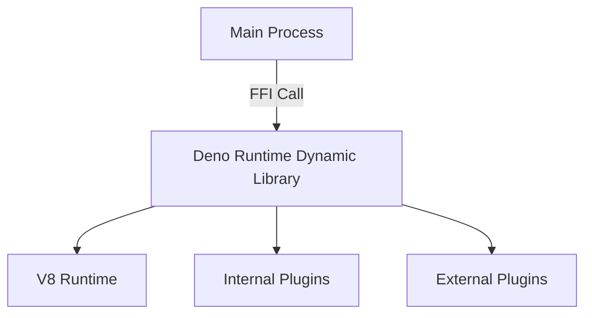
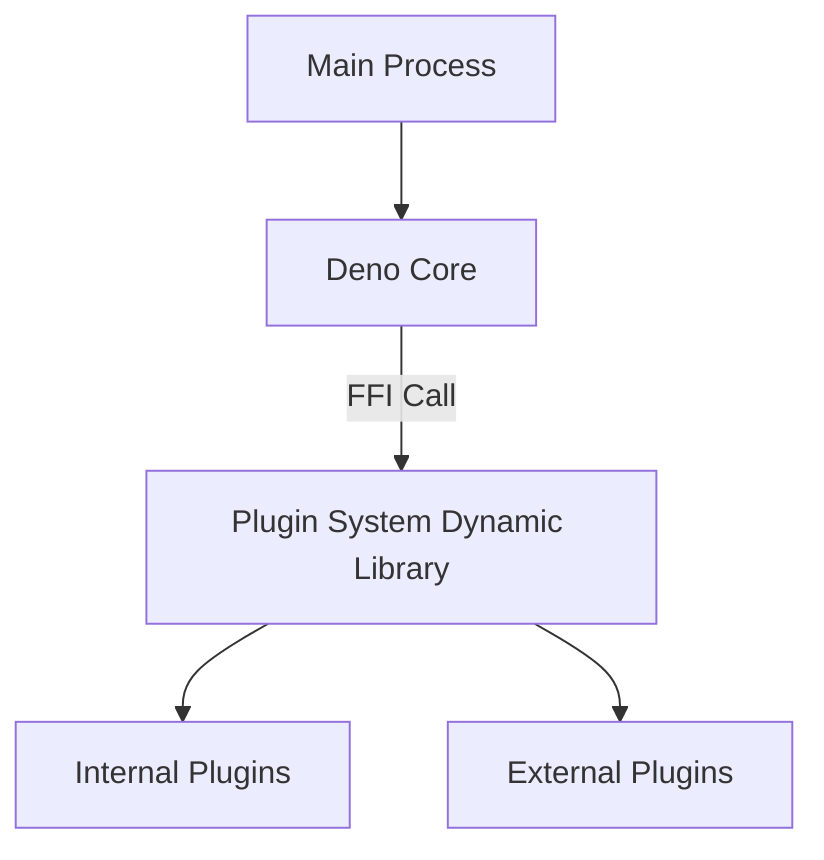
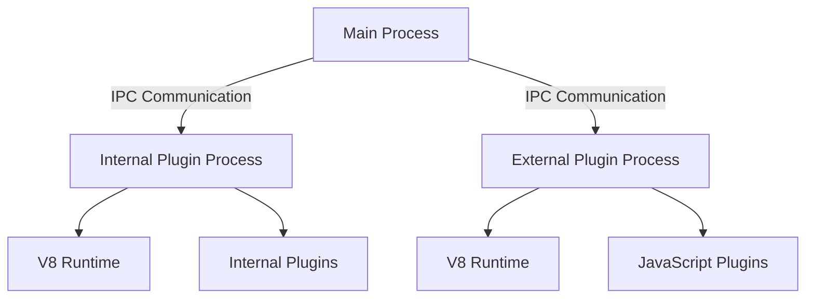

# Comprehensive Final Report on Deno_runtime External Binary Separation and Dynamic Linking

**Date**: January 21, 2026  
**Version**: 1.0  
**Project**: Sapphillon

---

## Introduction

### Purpose and Background of the Investigation

The Sapphillon project implements a JavaScript plugin system using Deno Runtime (Deno Core). Currently, internal plugins are statically linked with Deno Runtime and executed within the main process, while external plugins are executed as independent processes.

The purpose of this investigation is to evaluate the technical feasibility of separating Deno Runtime into an external binary and using dynamic linking, and to propose the optimal architecture. Dynamic linking is expected to provide the following benefits:

- Improved modularity
- Reduced binary size
- Independent plugin updates
- Enhanced security

### Scope of Investigation

This investigation was conducted within the following scope:

1. Possibility and technical constraints of dynamic linking in Rust
2. Compatibility between Deno Core's `#[op2]` macro and dynamic linking
3. OpState lifecycle and management
4. V8 runtime initialization and sharing
5. Evaluation of multiple architecture options
6. Analysis of benefits, drawbacks, and implementation costs for each option

---

## Project Overview

### Project Structure

Sapphillon is a gRPC-based workflow automation platform with the following structure:

```
Sapphillon/
├── src/                    # Main application
│   ├── main.rs            # Entry point
│   ├── server.rs          # gRPC server
│   ├── init.rs            # System initialization
│   ├── ext_plugin_manager.rs  # External plugin management
│   ├── plugin_installer.rs    # Plugin installer
│   └── services/          # gRPC service implementations
├── plugins/               # Internal plugins
│   ├── exec/             # Shell command execution
│   ├── fetch/            # HTTP requests
│   ├── filesystem/       # File system operations
│   ├── search/           # File search
│   └── window/           # Window operations
├── database/             # Database operations
├── entity/               # Database entities
├── migration/            # Database migrations
└── docs/                 # Documentation
```

**Main Dependencies**:

```toml
[dependencies]
deno_core = "0.363.0"
sapphillon_core = { git = "ssh://git@github.com/Sapphillon/Sapphillon-Core.git", tag = "v0.14.0" }
```

### Usage of Deno_runtime

Deno Runtime is used in two ways in the Sapphillon project:

#### 1. Usage in Internal Plugins

Internal plugins (exec, fetch, filesystem, search, window) are implemented in Rust and made callable from JavaScript using the `#[op2]` macro.

**Example: exec plugin** ([`plugins/exec/src/lib.rs`](plugins/exec/src/lib.rs:74))

```rust
#[op2]
#[string]
fn op2_exec(
    state: &mut OpState,
    #[string] command: String,
) -> std::result::Result<String, JsErrorBox> {
    ensure_permission(
        state,
        &exec_plugin_function().function_id,
        exec_plugin_permissions(),
        &command,
    )?;

    match exec(&command) {
        Ok(output) => Ok(output),
        Err(e) => Err(JsErrorBox::new("Error", e.to_string())),
    }
}
```

**Features**:
- Uses `#[op2]` macro to make Rust functions callable from JavaScript
- Shares workflow data through `OpState`
- Statically linked and executed within the main process

#### 2. Usage in External Plugins

External plugins are implemented in JavaScript and executed as independent processes.

**Example: Starting external plugin server** ([`src/main.rs`](src/main.rs:119))

```rust
Command::Ext { server_name } => {
    info!("Starting External Plugin Server {server_name}...");
    use sapphillon_core::ext_plugin::extplugin_server;
    extplugin_server(&server_name)?;
}
```

**Features**:
- Executed as an independent process
- Uses IPC communication to communicate with the main process
- Initializes V8 runtime within the external process

### Overview of Plugin System

The Sapphillon plugin system supports two types of plugins:

#### Internal Plugins

- **Implementation Language**: Rust
- **Execution Method**: Statically linked within the main process
- **Registration Method**: Uses `CorePluginFunction` and `CorePluginPackage`
- **Examples**: exec, fetch, filesystem, search, window

#### External Plugins

- **Implementation Language**: JavaScript
- **Execution Method**: Executed as an independent process
- **Registration Method**: Uses `extplugin_server`
- **Communication Method**: IPC communication
- **Installation Method**: Can only be installed from `https://` URIs to allowed trusted hosts (optionally with integrity checks)

---

## Deno_runtime Integration Methods

### Usage in Internal Plugins

Internal plugins are integrated with Deno Runtime through the following steps:

1. **Plugin Package Definition**:
   ```rust
   pub fn core_exec_plugin_package() -> CorePluginPackage {
       CorePluginPackage::new(
           "app.sapphillon.core.exec".to_string(),
           "Exec".to_string(),
           vec![core_exec_plugin()],
       )
   }
   ```

2. **Plugin Function Definition**:
   ```rust
   pub fn core_exec_plugin() -> CorePluginFunction {
       CorePluginFunction::new(
           "app.sapphillon.core.exec.exec".to_string(),
           "Exec".to_string(),
           "Executes a command in the default shell and returns its output.".to_string(),
           op2_exec(),
           Some(include_str!("00_exec.js").to_string()),
       )
   }
   ```

3. **Sharing Workflow Data Using OpState**:
   ```rust
   fn ensure_permission(
       state: &mut OpState,
       plugin_function_id: &str,
       required_permissions: Vec<Permission>,
       resource: &str,
   ) -> Result<(), JsErrorBox> {
       let data = state
           .borrow::<Arc<Mutex<OpStateWorkflowData>>>()
           .lock()
           .unwrap();
       let allowed = data.get_allowed_permissions().clone().unwrap_or_default();
       // ... permission check
   }
   ```

### Usage in External Plugins

External plugins are integrated with Deno Runtime through the following steps:

1. **Starting External Plugin Server**:
   ```rust
   use sapphillon_core::ext_plugin::extplugin_server;
   extplugin_server(&server_name)?;
   ```

2. **Communication with Main Process Using IPC**:
   - Uses `IpcOneShotServer` for one-shot communication
   - Establishes IPC communication when starting the plugin

3. **Installing External Plugins**:
   ```rust
   pub async fn install_ext_plugin(
       db: &DatabaseConnection,
       save_dir: &str,
       author_id: &str,
       package_id: &str,
       version: &str,
       package_js_content: &[u8],
   ) -> Result<String> {
       // Create directory structure
       // Write package.js file
       // Register in database
   }
   ```

### OpState Lifecycle and Management

`OpState` is a structure for managing Deno Core state and holds data shared between plugins.

#### Role of OpState

1. **Sharing Workflow Data**: Shares workflow permission information through `OpStateWorkflowData`
2. **Permission Checking**: Confirms permissions before executing plugin functions
3. **V8 Runtime State Management**: Manages V8 runtime state

#### OpState Lifecycle


#### Challenges in OpState Management

1. **Ownership**: `OpState` is typically initialized in the main process and passed to plugins
2. **Serialization**: `OpState` contains references to V8 runtime, making serialization difficult
3. **Sharing**: When separating as a dynamic library or external process, determining how to share `OpState` is a challenge

---

## Technical Evaluation of Dynamic Linking

### Possibility of Dynamic Linking in Rust

In Rust, you can create dynamic libraries (.dylib/.so/.dll) using the `cdylib` crate type.

#### Creating Dynamic Libraries

```toml
[lib]
crate-type = ["cdylib"]
```

This allows you to create dynamic libraries that comply with the C ABI.

#### Interface Design Using FFI (Foreign Function Interface)

You can use FFI to call Rust functions from other languages.

```rust
#[no_mangle]
pub extern "C" fn plugin_function(arg1: *const c_char, arg2: size_t) -> *mut c_char {
    // Implementation
}
```

#### Current Crate Type Status in the Project

Currently, all crates in the project do not have explicit `crate-type` specifications and use the default `["rlib"]`. To create dynamic libraries, you need to add `crate-type = ["cdylib"]` to each crate's `Cargo.toml`.

### Deno_core Constraints

#### Constraints of `#[op2]` Macro and Compatibility with Dynamic Linking

The `#[op2]` macro generates an interface with V8 runtime at compile time, so it is designed with static linking in mind. When using dynamic linking, the following challenges exist:

1. **Dependencies at Macro Expansion Time**: The `#[op2]` macro uses `deno_core` type information at compile time to generate code. When separating as a dynamic library, these type information must be available at runtime.

2. **V8 Runtime Initialization**: Functions defined with the `#[op2]` macro need to be called with V8 runtime initialized. When separating as a dynamic library, you need to decide in which process to initialize V8 runtime.

#### Challenges in OpState Management and Sharing

`OpState` is a structure for managing Deno Core state and holds data shared between plugins. When using dynamic linking, the following challenges exist:

1. **OpState Ownership**: `OpState` is typically initialized in the main process and passed to plugins. When separating as a dynamic library, you need to decide how to manage OpState ownership.

2. **OpState Serialization**: `OpState` contains references to V8 runtime, making serialization difficult. When separating as a dynamic library, you need to consider how to share OpState between processes.

#### JavaScript Runtime Initialization and Management

The initialization and management of JavaScript runtime (V8) is an important challenge when using dynamic linking.

1. **V8 Runtime Initialization**: V8 runtime needs to be initialized per process. When separating as a dynamic library, you need to decide in which process to initialize V8 runtime.

2. **V8 Runtime Sharing**: V8 runtime cannot be shared between processes. When separating as a dynamic library, you need to initialize V8 runtime in each process.

### Technical Challenges

The main technical challenges for implementing dynamic linking are as follows:

1. **Dependencies at `#[op2]` Macro Expansion Time**: Since code is generated using `deno_core` type information at compile time, there are compatibility issues with dynamic linking.

2. **OpState Ownership and Sharing**: Since it contains references to V8 runtime, serialization is difficult.

3. **V8 Runtime Initialization and Sharing**: It needs to be initialized per process and cannot be shared between processes.

---

## Architecture Design Options

### Option A: Separate Deno_runtime Entirely as a Dynamic Library



**Overview**:
- Separate the entire Deno Core as a dynamic library (.dylib/.so/.dll)
- Call Deno Runtime from the main process using FFI
- Internal and external plugins are managed within the Deno Runtime dynamic library

**Implementation Details**:
1. Change `sapphillon_core` to `cdylib` crate type
2. Use FFI interface to communicate between main process and Deno Runtime
3. Manage `OpState` within the dynamic library
4. Initialize V8 runtime within the dynamic library

### Option B: Separate Only Plugin System as a Dynamic Library



**Overview**:
- Separate only the plugin system as a dynamic library
- Initialize Deno Core in the main process
- Call plugins using FFI from the plugin system dynamic library

**Implementation Details**:
1. Change plugin system to `cdylib` crate type
2. Initialize `OpState` in the main process and pass it to the plugin system dynamic library
3. Use FFI interface to communicate between main process and plugin system
4. Manage internal and external plugins within the plugin system dynamic library

### Option C: Separate as External Process (Similar to Current External Plugins)



**Overview**:
- Separate the plugin system as an external process
- Use IPC communication to communicate between main process and external plugin process
- Architecture similar to current external plugins

**Implementation Details**:
1. Implement plugin system as an external process
2. Use IPC communication to communicate between main process and external plugin process
3. Initialize V8 runtime in the external plugin process
4. Execute JavaScript plugins in the external plugin process

### Alternative Approaches

#### Alternative Approach 1: Separation Using WebAssembly (WASM)

**Overview**:
- Implement plugins as WebAssembly
- Use WASM runtime to execute plugins

**Benefits**:
- Easy cross-platform support
- High security
- Good performance

**Drawbacks**:
- Large implementation effort (5-8 person-months)
- Existing plugins need to be converted to WASM
- WASM constraints exist

#### Alternative Approach 2: Microservices Using gRPC

**Overview**:
- Implement plugins as microservices
- Use gRPC for communication

**Benefits**:
- Easy cross-platform support
- High scalability
- Language-independent

**Drawbacks**:
- Large implementation effort (4-7 person-months)
- Lower performance than IPC communication
- Increased complexity

#### Alternative Approach 3: Separation Using IPC (Inter-Process Communication)

**Overview**:
- Implement plugins as external processes
- Use IPC for communication

**Benefits**:
- Small implementation effort (2-3 person-months)
- Architecture similar to existing external plugins
- Technically feasible

**Drawbacks**:
- Lower performance
- Increased memory usage

#### Alternative Approach 4: Complete Redesign of Plugin System

**Overview**:
- Completely redesign the plugin system
- Adopt a new architecture

**Benefits**:
- Can achieve optimal architecture
- Improved long-term maintainability

**Drawbacks**:
- Very large implementation effort (8-12 person-months)
- High risk
- Possible loss of compatibility with existing plugins

---

## Evaluation of Each Option

### Option A: Separate Deno_runtime Entirely as a Dynamic Library

#### Benefits

1. **Performance**: FFI calls are faster than inter-process communication (IPC). Since it becomes a call within the same process, there is no context switch overhead.

2. **Memory Efficiency**: Since V8 runtime is managed in one process, memory usage is reduced.

3. **Implementation Complexity**: There is no need to significantly change the current architecture; it can be achieved by simply adding an FFI interface.

#### Drawbacks

1. **`#[op2]` Macro Constraints**: The `#[op2]` macro generates an interface with V8 runtime at compile time, so there are compatibility issues with dynamic linking. When separating plugins using the `#[op2]` macro as a dynamic library, dependencies at macro expansion time need to be resolved.

2. **OpState Management**: `OpState` contains references to V8 runtime, so when separating as a dynamic library, you need to decide how to manage OpState ownership.

3. **V8 Runtime Initialization**: When initializing V8 runtime within the dynamic library, you need to share V8 runtime between the main process and the dynamic library. This is technically difficult.

4. **Compatibility**: When separating as a dynamic library, you need to create different binaries (.dylib/.so/.dll) for each platform. This complicates cross-platform support.

#### Feasibility: Low

**Reasons**:
- Due to constraints of the `#[op2]` macro, there are compatibility issues with dynamic linking.
- OpState management is complex, and V8 runtime needs to be initialized within the dynamic library.
- V8 runtime needs to be shared between the main process and the dynamic library, which is technically difficult.

### Option B: Separate Only Plugin System as a Dynamic Library

#### Benefits

1. **Performance**: FFI calls are faster than inter-process communication (IPC). Since it becomes a call within the same process, there is no context switch overhead.

2. **Memory Efficiency**: Since V8 runtime is managed in one process, memory usage is reduced.

3. **Implementation Complexity**: Since only the plugin system is separated as a dynamic library, there is no need to significantly change the current architecture.

#### Drawbacks

1. **`#[op2]` Macro Constraints**: The `#[op2]` macro generates an interface with V8 runtime at compile time, so there are compatibility issues with dynamic linking. When separating plugins using the `#[op2]` macro as a dynamic library, dependencies at macro expansion time need to be resolved.

2. **OpState Management**: `OpState` contains references to V8 runtime, so when separating as a dynamic library, you need to decide how to manage OpState ownership.

3. **V8 Runtime Initialization**: You need to initialize V8 runtime in the main process and pass it to the plugin system dynamic library. This is technically difficult.

4. **Compatibility**: When separating as a dynamic library, you need to create different binaries (.dylib/.so/.dll) for each platform. This complicates cross-platform support.

#### Feasibility: Low

**Reasons**:
- Due to constraints of the `#[op2]` macro, there are compatibility issues with dynamic linking.
- OpState management is complex, and V8 runtime needs to be initialized in the main process and passed to the plugin system dynamic library.
- V8 runtime needs to be shared between the main process and the plugin system dynamic library, which is technically difficult.

### Option C: Separate as External Process (Similar to Current External Plugins)

#### Benefits

1. **`#[op2]` Macro Compatibility**: When separating as an external process, you are not subject to the constraints of the `#[op2]` macro. You can initialize V8 runtime in the external process and execute JavaScript plugins.

2. **OpState Management**: When separating as an external process, you can manage `OpState` within the external process. There is no need to share `OpState` between the main process and the external process.

3. **V8 Runtime Initialization**: Since V8 runtime is initialized in the external process, there is no need to share V8 runtime between the main process and the external process.

4. **Compatibility**: When separating as an external process, you don't need to create different binaries for each platform. Cross-platform support is easy.

5. **Safety**: Plugin crashes do not affect the main process. You can detect plugin crashes and automatically restart them.

#### Drawbacks

1. **Performance**: IPC communication is slower than FFI calls. There is overhead for inter-process communication.

2. **Memory Efficiency**: Since V8 runtime is initialized in each external process, memory usage increases.

3. **Implementation Complexity**: When separating as an external process, you need to implement IPC communication. If you adopt an architecture similar to current external plugins, implementation complexity does not increase.

#### Feasibility: High

**Reasons**:
- Not subject to the constraints of the `#[op2]` macro. You can initialize V8 runtime in the external process and execute JavaScript plugins.
- You can manage `OpState` within the external process. There is no need to share `OpState` between the main process and the external process.
- Since V8 runtime is initialized in the external process, there is no need to share V8 runtime between the main process and the external process.
- If you adopt an architecture similar to current external plugins, implementation complexity does not increase.

### Comparison Table of Each Option

| Item | Option A | Option B | Option C |
|------|----------|----------|----------|
| Performance | High | High | Medium |
| Memory Efficiency | High | High | Low |
| Implementation Complexity | Medium | Medium | Low |
| `#[op2]` Macro Compatibility | Low | Low | High |
| OpState Management | Difficult | Difficult | Easy |
| V8 Runtime Initialization | Difficult | Difficult | Easy |
| Cross-Platform Support | Difficult | Difficult | Easy |
| Safety | Medium | Medium | High |
| Feasibility | Low | Low | High |
| Implementation Effort | 4-6 person-months | 3-5 person-months | 2-3 person-months |

---

## Conclusions

### Possibility of Separation as a Dynamic Library

**Conclusion: Separation as a dynamic library (.dylib/.so/.dll) is technically difficult**

While it is possible to create dynamic libraries using Rust's `cdylib` crate type, separation as dynamic linking is technically difficult due to the characteristics of Deno_runtime for the following reasons:

1. **`#[op2]` Macro Constraints**: The `#[op2]` macro generates an interface with V8 runtime at compile time, so it is designed with static linking in mind. When separating as a dynamic library, these type information must be available at runtime, but this is technically difficult.

2. **OpState Serialization Problem**: `OpState` contains references to V8 runtime, making serialization difficult. When separating as a dynamic library, you need to consider how to share OpState between processes, but this is technically very complex.

3. **V8 Runtime Initialization**: V8 runtime needs to be initialized per process. When separating as a dynamic library, you need to decide in which process to initialize V8 runtime, but this is technically difficult.

### Recommended Approach

**Conclusion: The approach of separating as an external process (Option C) is optimal**

While separation as a dynamic library is difficult, separation as an external process is possible and is the optimal approach for the following reasons:

1. **`#[op2]` Macro Compatibility**: When separating as an external process, you are not subject to the constraints of the `#[op2]` macro. You can initialize V8 runtime in the external process and execute JavaScript plugins.

2. **OpState Management**: When separating as an external process, you can manage `OpState` within the external process. There is no need to share `OpState` between the main process and the external process.

3. **V8 Runtime Initialization**: Since V8 runtime is initialized in the external process, there is no need to share V8 runtime between the main process and the external process.

4. **Safety**: Plugin crashes do not affect the main process. You can detect plugin crashes and automatically restart them.

5. **Compatibility**: Cross-platform support is easy. You don't need to create different binaries for each platform.

### Technical Challenges and Constraints

**Challenges Related to Separation as a Dynamic Library**:

1. **Dependencies at `#[op2]` Macro Expansion Time**: The `#[op2]` macro uses `deno_core` type information at compile time to generate code. When separating as a dynamic library, these type information must be available at runtime.

2. **OpState Ownership and Sharing**: `OpState` is typically initialized in the main process and passed to plugins. When separating as a dynamic library, you need to decide how to manage OpState ownership.

3. **V8 Runtime Initialization and Sharing**: V8 runtime needs to be initialized per process. When separating as a dynamic library, you need to decide in which process to initialize V8 runtime.

**Challenges Related to Separation as an External Process**:

1. **Performance**: IPC communication is slower than FFI calls. There is overhead for inter-process communication.

2. **Memory Efficiency**: Since V8 runtime is initialized in each external process, memory usage increases.

3. **Implementation Complexity**: When separating as an external process, you need to implement IPC communication. If you adopt an architecture similar to current external plugins, implementation complexity does not increase.

---

## Recommendations

### Recommended Approach and Reasons

**Recommendation: Option C - Separate as External Process (Similar to Current External Plugins)**

**Reasons**:

1. **Technically Feasible**: Not subject to the constraints of the `#[op2]` macro, and OpState management is easy.

2. **Safety**: Plugin crashes do not affect the main process. You can detect plugin crashes and automatically restart them.

3. **Compatibility**: Cross-platform support is easy. You don't need to create different binaries for each platform.

4. **Existing Architecture**: If you adopt an architecture similar to current external plugins, implementation complexity does not increase.

5. **Scalability**: Since each plugin can be executed as an independent process, resource isolation and management is easy.

**Architecture Diagram**:


### Steps Required for Implementation

#### Step 1: External Process Conversion of Internal Plugins

- Implement internal plugins (fetch, filesystem, exec, search, window) as external processes
- Execute each internal plugin as an independent external process
- Use IPC communication to communicate between main process and external process

#### Step 2: IPC Communication Optimization

- Change from current one-shot communication using `IpcOneShotServer` to persistent communication
- Implement connection retry mechanism
- Implement error recovery mechanism

#### Step 3: External Process Lifecycle Management

- Manage startup, termination, and restart of external processes
- Monitor external process status
- Manage external process resources (memory, CPU)

#### Step 4: Test Updates

- Update internal plugin tests to be external process-based
- Extend external plugin tests

#### Step 5: Performance and Memory Usage Measurement

- Measure performance and memory usage
- Optimize as necessary

### Considerations and Risks

**Considerations**:

1. **To minimize performance degradation, IPC communication needs to be optimized**:
   - Use persistent connections
   - Use buffering
   - Use asynchronous communication

2. **To reduce memory usage, external process lifecycle needs to be properly managed**:
   - Terminate unnecessary processes
   - Consider process reuse
   - Set memory limits

3. **Cross-platform support needs to be considered**:
   - Ensure operation on Windows, macOS, and Linux
   - Address platform-specific issues

**Risks**:

1. **Performance Degradation**: Due to IPC communication overhead, performance may degrade. Current architecture (internal plugins): call latency ~1-10μs, memory usage ~20-150MB, while separation as external process: call latency ~1-10ms, memory usage ~80-600MB.

2. **Increased Memory Usage**: Since V8 runtime is initialized in each external process, memory usage may increase.

3. **Implementation Complexity**: When separating as an external process, you need to implement IPC communication. If you adopt an architecture similar to current external plugins, implementation complexity does not increase.

4. **Compatibility Issues**: When converting existing internal plugins to external processes, compatibility issues may arise.

---

## Next Steps

### Next Steps if Proceeding with Implementation

#### Phase 1: Design and Planning

1. **Detailed Design of External Process Conversion**:
   - Detailed design of internal plugin external process conversion
   - Design of IPC communication protocol
   - Design of external process lifecycle management

2. **Prototype Creation**:
   - Create a prototype for external process conversion of a simple internal plugin (e.g., exec)
   - Create an IPC communication prototype
   - Measure performance and memory usage

#### Phase 2: Implementation

3. **Internal Plugin External Process Conversion**:
   - External process conversion of fetch plugin
   - External process conversion of filesystem plugin
   - External process conversion of exec plugin
   - External process conversion of search plugin
   - External process conversion of window plugin

4. **IPC Communication Optimization**:
   - Implement persistent connections
   - Implement connection retry mechanism
   - Implement error recovery mechanism

5. **External Process Lifecycle Management**:
   - Implement management of external process startup, termination, and restart
   - Implement external process status monitoring
   - Implement external process resource (memory, CPU) management

#### Phase 3: Testing and Verification

6. **Test Updates**:
   - Update internal plugin tests to be external process-based
   - Extend external plugin tests

7. **Performance and Memory Usage Measurement**:
   - Measure performance and memory usage
   - Optimize as necessary

#### Phase 4: Deployment and Monitoring

8. **Deployment**:
   - Deploy to production environment
   - Notify users

9. **Monitoring**:
   - Monitor performance and memory usage
   - Detect and fix issues

### Items Requiring Evaluation and Verification

#### Performance Evaluation

1. **Call Latency**:
   - Measure internal plugin call latency
   - Measure call latency after external process conversion
   - Evaluate whether performance degradation is within acceptable range

2. **Throughput**:
   - Measure calls per second
   - Measure throughput after external process conversion
   - Evaluate whether throughput degradation is within acceptable range

#### Memory Usage Evaluation

3. **Memory Usage**:
   - Measure internal plugin memory usage
   - Measure memory usage after external process conversion
   - Evaluate whether memory usage increase is within acceptable range

#### Stability Evaluation

4. **Stability**:
   - Verify external process crash detection and restart behavior
   - Verify stability during long-running operation
   - Verify stability under high load

#### Compatibility Evaluation

5. **Compatibility**:
   - Verify compatibility with existing internal plugins
   - Verify compatibility with existing external plugins
   - Verify cross-platform support

#### Usability Evaluation

6. **Usability**:
   - Evaluate impact on user experience
   - Evaluate configuration complexity
   - Evaluate need for documentation

---

## Appendix

### Glossary

| Term | Description |
|------|------------|
| **Dynamic Linking** | A method of loading libraries at program runtime. Unlike static linking, libraries are loaded at runtime, which can reduce binary size. |
| **cdylib** | Rust's crate type for creating dynamic libraries that comply with the C ABI. |
| **FFI (Foreign Function Interface)** | An interface for calling functions between different programming languages. |
| **Deno Core** | The core part of Deno's JavaScript runtime. Uses the V8 engine to execute JavaScript. |
| **V8 Runtime** | JavaScript engine developed by Google. Used in Deno Core. |
| **`#[op2]` Macro** | A macro used in Deno Core. Generates an interface to make Rust functions callable from JavaScript. |
| **OpState** | A structure for managing Deno Core state. Holds data shared between plugins. |
| **IPC (Inter-Process Communication)** | Inter-process communication. A mechanism for exchanging data between different processes. |
| **Internal Plugins** | Plugins implemented in Rust, statically linked and executed within the main process. |
| **External Plugins** | Plugins implemented in JavaScript, executed as independent processes. |
| **gRPC** | RPC framework developed by Google. Uses HTTP/2 and Protocol Buffers to serialize data. |
| **WebAssembly (WASM)** | A binary format that can be executed in environments other than web browsers. |

### References

1. **Rust FFI**  
   https://doc.rust-lang.org/nomicon/ffi.html

2. **Deno Core**  
   https://github.com/denoland/deno_core

3. **Deno Op**  
   https://docs.deno.com/runtime/manual/advanced/rust_ops

4. **Dynamic Linking in Rust**  
   https://doc.rust-lang.org/reference/linkage.html

5. **Sapphillon Dynamic Linking Evaluation**  
   [`docs/dynamic_linking_evaluation.md`](docs/dynamic_linking_evaluation.md)

6. **Sapphillon Dynamic Linking Final Conclusion**  
   [`docs/dynamic_linking_final_conclusion.md`](docs/dynamic_linking_final_conclusion.md)

7. **Sapphillon-Core Repository**  
   https://github.com/Sapphillon/Sapphillon-Core

8. **Protocol Buffers**  
   https://developers.google.com/protocol-buffers

9. **gRPC**  
   https://grpc.io/

10. **WebAssembly**  
    https://webassembly.org/

---

**End of Document**
