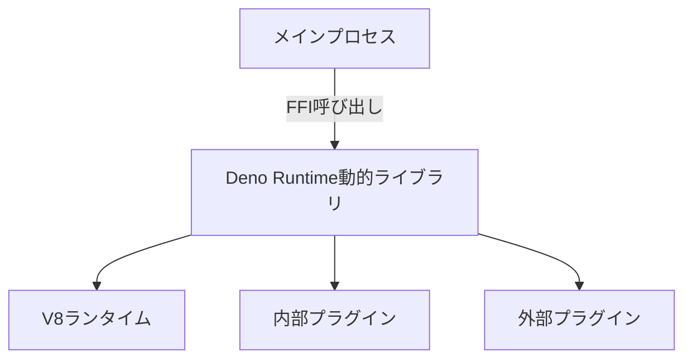
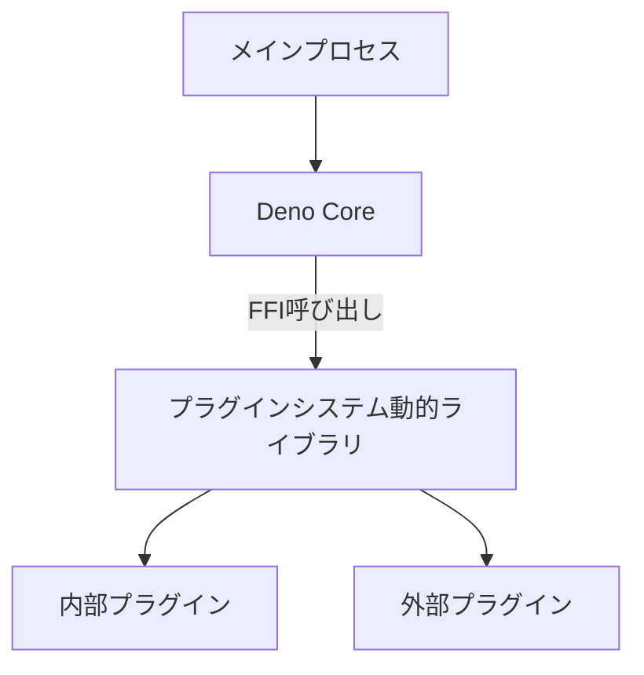
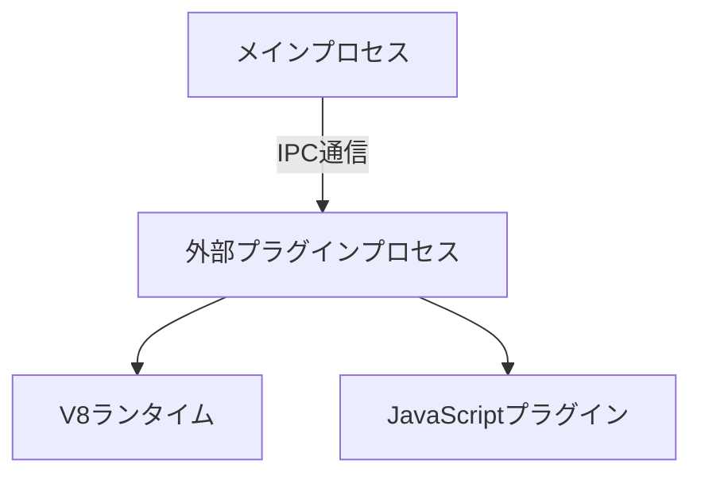

# Deno_runtimeの動的リンクに関する技術評価

## 概要

本ドキュメントは、SapphillonプロジェクトにおけるDeno_runtimeを外部バイナリに分離して動的リンクする可能性についての技術的な評価をまとめたものです。

## 1. Rustでの動的リンクの可能性

### 1.1 Rustで動的ライブラリを作成する方法

Rustでは、`cdylib` crate typeを使用して動的ライブラリ（.dylib/.so/.dll）を作成することができます。

```toml
[lib]
crate-type = ["cdylib"]
```

これにより、C ABIに準拠した動的ライブラリを作成することができます。

### 1.2 FFI（Foreign Function Interface）を使用したインターフェースの設計

FFIを使用して、他の言語からRustの関数を呼び出すことができます。以下のように、`extern "C"`を使用してC ABIの関数を定義します。

```rust
#[no_mangle]
pub extern "C" fn plugin_function(arg1: *const c_char, arg2: size_t) -> *mut c_char {
    // 実装
}
```

### 1.3 プロジェクトでのcrate typeの現状

現在、プロジェクトのすべてのcrateは明示的な`crate-type`指定がなく、デフォルトの`["rlib"]`を使用しています。動的ライブラリを作成するには、各crateの`Cargo.toml`に`crate-type = ["cdylib"]`を追加する必要があります。

## 2. Deno_coreの動的リンクに関する課題

### 2.1 `#[op2]`マクロの制約と動的リンクとの互換性

`#[op2]`マクロは、コンパイル時にV8ランタイムとのインターフェースを生成するため、静的リンクを前提として設計されています。動的リンクを使用する場合、以下の課題があります：

1. **マクロの展開時の依存**: `#[op2]`マクロは、コンパイル時に`deno_core`の型情報を使用してコードを生成します。動的ライブラリとして分離する場合、これらの型情報が実行時に利用可能である必要があります。

2. **V8ランタイムの初期化**: `#[op2]`マクロで定義された関数は、V8ランタイムが初期化された状態で呼び出される必要があります。動的ライブラリとして分離する場合、V8ランタイムの初期化をどのプロセスで行うかを決定する必要があります。

### 2.2 OpStateの管理と共有の課題

`OpState`は、Deno Coreの状態を管理するための構造体であり、プラグイン間で共有されるデータを保持します。動的リンクを使用する場合、以下の課題があります：

1. **OpStateの所有権**: `OpState`は、通常、メインプロセスで初期化され、プラグインに渡されます。動的ライブラリとして分離する場合、`OpState`の所有権をどのように管理するかを決定する必要があります。

2. **OpStateのシリアライズ**: `OpState`は、V8ランタイムへの参照を含むため、シリアライズが困難です。動的ライブラリとして分離する場合、`OpState`をプロセス間で共有する方法を検討する必要があります。

### 2.3 JavaScriptランタイムの初期化と管理

JavaScriptランタイム（V8）の初期化と管理は、動的リンクを使用する場合に重要な課題です。

1. **V8ランタイムの初期化**: V8ランタイムは、プロセスごとに初期化する必要があります。動的ライブラリとして分離する場合、V8ランタイムの初期化をどのプロセスで行うかを決定する必要があります。

2. **V8ランタイムの共有**: V8ランタイムは、プロセス間で共有することができません。動的ライブラリとして分離する場合、各プロセスでV8ランタイムを初期化する必要があります。

## 3. アーキテクチャの設計オプション

### 3.1 オプションA: Deno_runtime全体を動的ライブラリとして分離



**概要**:
- Deno Core全体を動的ライブラリ（.dylib/.so/.dll）として分離
- メインプロセスからFFIを使用してDeno Runtimeを呼び出す
- 内部プラグインと外部プラグインは、Deno Runtime動的ライブラリ内で管理

**実装の詳細**:
1. `sapphillon_core`を`cdylib` crate typeに変更
2. FFIインターフェースを使用して、メインプロセスとDeno Runtime間で通信
3. `OpState`を動的ライブラリ内で管理
4. V8ランタイムを動的ライブラリ内で初期化

### 3.2 オプションB: プラグインシステムのみを動的ライブラリとして分離



**概要**:
- プラグインシステムのみを動的ライブラリとして分離
- メインプロセスでDeno Coreを初期化
- プラグインシステム動的ライブラリからFFIを使用してプラグインを呼び出す

**実装の詳細**:
1. プラグインシステムを`cdylib` crate typeに変更
2. メインプロセスで`OpState`を初期化し、プラグインシステム動的ライブラリに渡す
3. FFIインターフェースを使用して、メインプロセスとプラグインシステム間で通信
4. 内部プラグインと外部プラグインをプラグインシステム動的ライブラリ内で管理

### 3.3 オプションC: 外部プロセスとして分離（現在の外部プラグインと同様）



**概要**:
- プラグインシステムを外部プロセスとして分離
- IPC通信を使用して、メインプロセスと外部プラグインプロセス間で通信
- 現在の外部プラグインと同様のアーキテクチャ

**実装の詳細**:
1. プラグインシステムを外部プロセスとして実装
2. IPC通信を使用して、メインプロセスと外部プラグインプロセス間で通信
3. 外部プラグインプロセスでV8ランタイムを初期化
4. JavaScriptプラグインを外部プラグインプロセスで実行

## 4. 各オプションのメリットとデメリット

### 4.1 オプションA: Deno_runtime全体を動的ライブラリとして分離

#### メリット

1. **パフォーマンス**: FFI呼び出しは、プロセス間通信（IPC）よりも高速です。同一プロセス内での呼び出しになるため、コンテキストスイッチのオーバーヘッドがありません。

2. **メモリ効率**: V8ランタイムを1つのプロセスで管理するため、メモリ使用量が削減されます。

3. **実装の複雑さ**: 現在のアーキテクチャを大きく変更する必要がなく、FFIインターフェースを追加するだけで実現できます。

#### デメリット

1. **`#[op2]`マクロの制約**: `#[op2]`マクロは、コンパイル時にV8ランタイムとのインターフェースを生成するため、動的リンクとの互換性に問題があります。`#[op2]`マクロを使用したプラグインを動的ライブラリとして分離する場合、マクロの展開時の依存を解決する必要があります。

2. **OpStateの管理**: `OpState`は、V8ランタイムへの参照を含むため、動的ライブラリとして分離する場合、`OpState`の所有権をどのように管理するかを決定する必要があります。

3. **V8ランタイムの初期化**: V8ランタイムを動的ライブラリ内で初期化する場合、メインプロセスと動的ライブラリ間でV8ランタイムを共有する必要があります。これは技術的に困難です。

4. **互換性**: 動的ライブラリとして分離する場合、プラットフォームごとに異なるバイナリ（.dylib/.so/.dll）を作成する必要があります。これは、クロスプラットフォーム対応を複雑にします。

### 4.2 オプションB: プラグインシステムのみを動的ライブラリとして分離

#### メリット

1. **パフォーマンス**: FFI呼び出しは、プロセス間通信（IPC）よりも高速です。同一プロセス内での呼び出しになるため、コンテキストスイッチのオーバーヘッドがありません。

2. **メモリ効率**: V8ランタイムを1つのプロセスで管理するため、メモリ使用量が削減されます。

3. **実装の複雑さ**: プラグインシステムのみを動的ライブラリとして分離するため、現在のアーキテクチャを大きく変更する必要がありません。

#### デメリット

1. **`#[op2]`マクロの制約**: `#[op2]`マクロは、コンパイル時にV8ランタイムとのインターフェースを生成するため、動的リンクとの互換性に問題があります。`#[op2]`マクロを使用したプラグインを動的ライブラリとして分離する場合、マクロの展開時の依存を解決する必要があります。

2. **OpStateの管理**: `OpState`は、V8ランタイムへの参照を含むため、動的ライブラリとして分離する場合、`OpState`の所有権をどのように管理するかを決定する必要があります。

3. **V8ランタイムの初期化**: V8ランタイムをメインプロセスで初期化し、プラグインシステム動的ライブラリに渡す必要があります。これは技術的に困難です。

4. **互換性**: 動的ライブラリとして分離する場合、プラットフォームごとに異なるバイナリ（.dylib/.so/.dll）を作成する必要があります。これは、クロスプラットフォーム対応を複雑にします。

### 4.3 オプションC: 外部プロセスとして分離（現在の外部プラグインと同様）

#### メリット

1. **`#[op2]`マクロの互換性**: 外部プロセスとして分離する場合、`#[op2]`マクロの制約を受けません。外部プロセスでV8ランタイムを初期化し、JavaScriptプラグインを実行できます。

2. **OpStateの管理**: 外部プロセスとして分離する場合、`OpState`を外部プロセス内で管理できます。メインプロセスと外部プロセス間で`OpState`を共有する必要がありません。

3. **V8ランタイムの初期化**: 外部プロセスでV8ランタイムを初期化するため、メインプロセスと外部プロセス間でV8ランタイムを共有する必要がありません。

4. **互換性**: 外部プロセスとして分離する場合、プラットフォームごとに異なるバイナリを作成する必要がありません。クロスプラットフォーム対応が容易です。

5. **安全性**: 外部プロセスとして分離する場合、プラグインのクラッシュがメインプロセスに影響を与えません。プラグインのクラッシュを検出し、自動的に再起動することができます。

#### デメリット

1. **パフォーマンス**: IPC通信は、FFI呼び出しよりも低速です。プロセス間通信のオーバーヘッドが発生します。

2. **メモリ効率**: 各外部プロセスでV8ランタイムを初期化するため、メモリ使用量が増加します。

3. **実装の複雑さ**: 外部プロセスとして分離する場合、IPC通信を実装する必要があります。現在の外部プラグインと同様のアーキテクチャを採用する場合、実装の複雑さは増加します。

## 5. 実装の可能性と推奨事項

### 5.1 技術的に実現可能なオプション

#### オプションA: Deno_runtime全体を動的ライブラリとして分離

**実現可能性**: 低

**理由**:
- `#[op2]`マクロの制約により、動的リンクとの互換性に問題があります。
- `OpState`の管理が複雑であり、V8ランタイムを動的ライブラリ内で初期化する必要があります。
- V8ランタイムをメインプロセスと動的ライブラリ間で共有する必要がありますが、これは技術的に困難です。

#### オプションB: プラグインシステムのみを動的ライブラリとして分離

**実現可能性**: 低

**理由**:
- `#[op2]`マクロの制約により、動的リンクとの互換性に問題があります。
- `OpState`の管理が複雑であり、V8ランタイムをメインプロセスで初期化し、プラグインシステム動的ライブラリに渡す必要があります。
- V8ランタイムをメインプロセスとプラグインシステム動的ライブラリ間で共有する必要がありますが、これは技術的に困難です。

#### オプションC: 外部プロセスとして分離（現在の外部プラグインと同様）

**実現可能性**: 高

**理由**:
- `#[op2]`マクロの制約を受けません。外部プロセスでV8ランタイムを初期化し、JavaScriptプラグインを実行できます。
- `OpState`を外部プロセス内で管理できます。メインプロセスと外部プロセス間で`OpState`を共有する必要がありません。
- V8ランタイムを外部プロセスで初期化するため、メインプロセスと外部プロセス間でV8ランタイムを共有する必要がありません。
- 現在の外部プラグインと同様のアーキテクチャを採用する場合、実装の複雑さは増加しません。

### 5.2 推奨されるアプローチ

**推奨**: オプションC: 外部プロセスとして分離（現在の外部プラグインと同様）

**理由**:
1. **技術的に実現可能**: `#[op2]`マクロの制約を受けず、`OpState`の管理が容易です。
2. **安全性**: プラグインのクラッシュがメインプロセスに影響を与えません。プラグインのクラッシュを検出し、自動的に再起動することができます。
3. **互換性**: クロスプラットフォーム対応が容易です。
4. **既存のアーキテクチャ**: 現在の外部プラグインと同様のアーキテクチャを採用する場合、実装の複雑さは増加しません。

**注意点**:
- パフォーマンスの低下を最小限に抑えるため、IPC通信を最適化する必要があります。
- メモリ使用量を削減するため、外部プロセスのライフサイクルを適切に管理する必要があります。

### 5.3 必要な変更の概要

#### オプションC: 外部プロセスとして分離（現在の外部プラグインと同様）

**変更の概要**:

1. **内部プラグインの外部プロセス化**:
   - 内部プラグイン（fetch、filesystem、exec、search、window）を外部プロセスとして実装
   - 各内部プラグインを独立した外部プロセスとして実行
   - IPC通信を使用して、メインプロセスと外部プロセス間で通信

2. **IPC通信の最適化**:
   - 現在の`IpcOneShotServer`を使用したワンショット通信から、持続的な通信に変更
   - 接続再試行のメカニズムを実装
   - エラー回復メカニズムを実装

3. **外部プロセスのライフサイクル管理**:
   - 外部プロセスの起動、終了、再起動を管理
   - 外部プロセスの状態を監視
   - 外部プロセスのリソース（メモリ、CPU）を管理

4. **テストの更新**:
   - 内部プラグインのテストを外部プロセスベースに更新
   - 外部プラグインのテストを拡張

**実装の手順**:

1. 内部プラグインの外部プロセス化を設計
2. IPC通信の最適化を実装
3. 外部プロセスのライフサイクル管理を実装
4. テストを更新
5. パフォーマンスとメモリ使用量を測定
6. 必要に応じて最適化

## 6. まとめ

Deno_runtimeを外部バイナリに分離して動的リンクする可能性について技術的な評価を行いました。

### 6.1 結論

1. **Rustでの動的リンク**: `cdylib` crate typeを使用して動的ライブラリを作成することができます。しかし、`#[op2]`マクロの制約により、Deno Coreの動的リンクは技術的に困難です。

2. **Deno_coreの動的リンクに関する課題**: `#[op2]`マクロの制約、`OpState`の管理、V8ランタイムの初期化と管理が主要な課題です。

3. **アーキテクチャの設計オプション**: 3つのオプション（オプションA、オプションB、オプションC）を検討しました。オプションC（外部プロセスとして分離）が技術的に実現可能で、推奨されるアプローチです。

4. **各オプションのメリットとデメリット**: オプションAとオプションBは、パフォーマンスとメモリ効率の面で有利ですが、`#[op2]`マクロの制約により実現が困難です。オプションCは、パフォーマンスとメモリ効率の面で不利ですが、`#[op2]`マクロの制約を受けず、実現が容易です。

5. **実装の可能性と推奨事項**: オプションC（外部プロセスとして分離）が技術的に実現可能で、推奨されるアプローチです。必要な変更の概要をまとめました。

### 6.2 今後のステップ

1. オプションC（外部プロセスとして分離）の詳細な設計
2. 内部プラグインの外部プロセス化の実装
3. IPC通信の最適化の実装
4. 外部プロセスのライフサイクル管理の実装
5. テストの更新
6. パフォーマンスとメモリ使用量の測定
7. 必要に応じて最適化

## 参考資料

- [Rust FFI](https://doc.rust-lang.org/nomicon/ffi.html)
- [Deno Core](https://github.com/denoland/deno_core)
- [Deno Op](https://docs.deno.com/runtime/manual/advanced/rust_ops)
- [Dynamic Linking in Rust](https://doc.rust-lang.org/reference/linkage.html)
