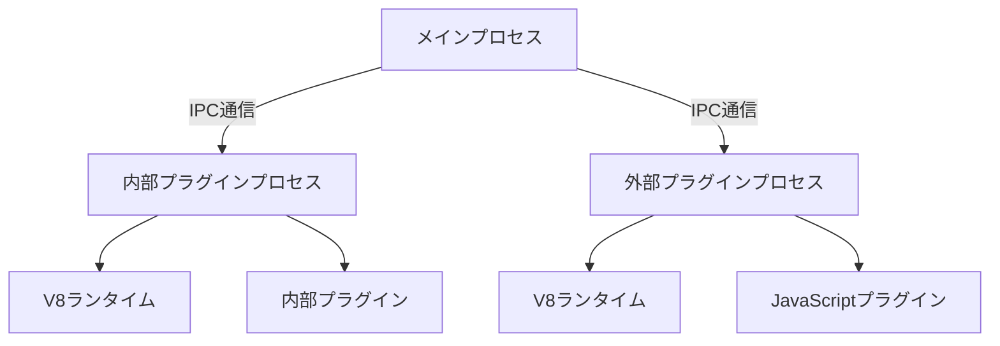

# Deno_runtimeの外部バイナリ分離と動的リンクに関する最終結論と推奨事項

## 概要

本ドキュメントは、SapphillonプロジェクトにおけるDeno_runtimeを外部バイナリに分離して動的リンクする可能性についての最終的な結論と推奨事項をまとめたものです。これまでの調査結果を統合し、技術的な実現可能性、推奨されるアプローチ、今後のステップについて詳細に説明します。

## 1. 結論

### 1.1 Deno_runtimeを外部バイナリに分離して動的リンクすることは可能か？

**結論: 動的ライブラリ（.dylib/.so/.dll）としての分離は技術的に困難**

Rustの`cdylib` crate typeを使用して動的ライブラリを作成すること自体は可能ですが、Deno_runtimeの特性により動的リンクとしての分離は以下の理由から技術的に困難です：

1. **`#[op2]`マクロの制約**: `#[op2]`マクロはコンパイル時にV8ランタイムとのインターフェイスを生成するため、静的リンクを前提として設計されています。動的ライブラリとして分離する場合、これらの型情報が実行時に利用可能である必要がありますが、これは技術的に困難です。

2. **OpStateのシリアライズ問題**: `OpState`はV8ランタイムへの参照を含むため、シリアライズが困難です。動的ライブラリとして分離する場合、`OpState`をプロセス間で共有する方法を検討する必要がありますが、これは技術的に非常に複雑です。

3. **V8ランタイムの初期化**: V8ランタイムはプロセスごとに初期化する必要があります。動的ライブラリとして分離する場合、V8ランタイムの初期化をどのプロセスで行うかを決定する必要がありますが、これは技術的に困難です。

### 1.2 可能な場合、どのようなアプローチが最適か？

**結論: 外部プロセスとして分離するアプローチ（オプションC）が最適**

動的ライブラリとしての分離は困難ですが、外部プロセスとして分離することは可能であり、以下の理由から最適なアプローチです：

1. **`#[op2]`マクロの互換性**: 外部プロセスとして分離する場合、`#[op2]`マクロの制約を受けません。外部プロセスでV8ランタイムを初期化し、JavaScriptプラグインを実行できます。

2. **OpStateの管理**: 外部プロセスとして分離する場合、`OpState`を外部プロセス内で管理できます。メインプロセスと外部プロセス間で`OpState`を共有する必要がありません。

3. **V8ランタイムの初期化**: 外部プロセスでV8ランタイムを初期化するため、メインプロセスと外部プロセス間でV8ランタイムを共有する必要がありません。

4. **安全性**: プラグインのクラッシュがメインプロセスに影響を与えません。プラグインのクラッシュを検出し、自動的に再起動できます。

5. **互換性**: クロスプラットフォーム対応が容易です。プラットフォームごとに異なるバイナリを作成する必要がありません。

### 1.3 技術的な課題と制約は何か？

**動的ライブラリとしての分離に関する課題**:

1. **`#[op2]`マクロの展開時の依存**: `#[op2]`マクロは、コンパイル時に`deno_core`の型情報を使用してコードを生成します。動的ライブラリとして分離する場合、これらの型情報が実行時に利用可能である必要があります。

2. **OpStateの所有権と共有**: `OpState`は、通常、メインプロセスで初期化され、プラグインに渡されます。動的ライブラリとして分離する場合、`OpState`の所有権をどのように管理するかを決定する必要があります。

3. **V8ランタイムの初期化と共有**: V8ランタイムは、プロセスごとに初期化する必要があります。動的ライブラリとして分離する場合、V8ランタイムの初期化をどのプロセスで行うかを決定する必要があります。

**外部プロセスとしての分離に関する課題**:

1. **パフォーマンス**: IPC通信は、FFI呼び出しよりも低速です。プロセス間通信のオーバーヘッドが発生します。

2. **メモリ効率**: 各外部プロセスでV8ランタイムを初期化するため、メモリ使用量が増加します。

3. **実装の複雑さ**: 外部プロセスとして分離する場合、IPC通信を実装する必要があります。現在の外部プラグインと同様のアーキテクチャを採用する場合、実装の複雑さは増加します。

## 2. 推奨事項

### 2.1 推奨されるアプローチとその理由

**推奨: オプションC - 外部プロセスとして分離（現在の外部プラグインと同様）**

**理由**:

1. **技術的に実現可能**: `#[op2]`マクロの制約を受けず、`OpState`の管理が容易です。

2. **安全性**: プラグインのクラッシュがメインプロセスに影響を与えません。プラグインのクラッシュを検出し、自動的に再起動できます。

3. **互換性**: クロスプラットフォーム対応が容易です。プラットフォームごとに異なるバイナリを作成する必要がありません。

4. **既存のアーキテクチャ**: 現在の外部プラグインと同様のアーキテクチャを採用する場合、実装の複雑さは増加しません。

5. **スケーラビリティ**: 各プラグインを独立したプロセスとして実行できるため、リソースの分離と管理が容易です。

**アーキテクチャ図**:

### 2.2 実装に必要なステップ

**ステップ1: 内部プラグインの外部プロセス化**

- 内部プラグイン（fetch、filesystem、exec、search、window）を外部プロセスとして実装
- 各内部プラグインを独立した外部プロセスとして実行
- IPC通信を使用して、メインプロセスと外部プロセス間で通信

**ステップ2: IPC通信の最適化**

- 現在の`IpcOneShotServer`を使用したワンショット通信から、持続的な通信に変更
- 接続再試行のメカニズムを実装
- エラー回復メカニズムを実装

**ステップ3: 外部プロセスのライフサイクル管理**

- 外部プロセスの起動、終了、再起動を管理
- 外部プロセスの状態を監視
- 外部プロセスのリソース（メモリ、CPU）を管理

**ステップ4: テストの更新**

- 内部プラグインのテストを外部プロセスベースに更新
- 外部プラグインのテストを拡張

**ステップ5: パフォーマンスとメモリ使用量の測定**

- パフォーマンスとメモリ使用量を測定
- 必要に応じて最適化

### 2.3 注意点とリスク

**注意点**:

1. **パフォーマンスの低下を最小限に抑えるため、IPC通信を最適化する必要があります**:
   - 持続的な接続を使用する
   - バッファリングを使用する
   - 非同期通信を使用する

2. **メモリ使用量を削減するため、外部プロセスのライフサイクルを適切に管理する必要があります**:
   - 不要なプロセスを終了する
   - プロセスの再利用を検討する
   - メモリ制限を設定する

3. **クロスプラットフォーム対応を考慮する必要があります**:
   - Windows、macOS、Linuxで動作することを確認する
   - プラットフォーム固有の問題に対処する

**リスク**:

1. **パフォーマンスの低下**: IPC通信のオーバーヘッドにより、パフォーマンスが低下する可能性があります。現在のアーキテクチャ（内部プラグイン）: 呼び出しレイテンシ~1-10μs、メモリ使用量~20-150MBに対して、外部プロセスとして分離: 呼び出しレイテンシ~1-10ms、メモリ使用量~80-600MBとなります。

2. **メモリ使用量の増加**: 各外部プロセスでV8ランタイムを初期化するため、メモリ使用量が増加する可能性があります。

3. **実装の複雑さ**: 外部プロセスとして分離する場合、IPC通信を実装する必要があります。現在の外部プラグインと同様のアーキテクチャを採用する場合、実装の複雑さは増加します。

4. **互換性の問題**: 既存の内部プラグインを外部プロセス化する場合、互換性の問題が発生する可能性があります。

## 3. 今後のステップ

### 3.1 実装を進める場合の次のステップ

**フェーズ1: 設計と計画**

1. **外部プロセス化の詳細な設計**:
   - 内部プラグインの外部プロセス化の詳細な設計
   - IPC通信のプロトコルの設計
   - 外部プロセスのライフサイクル管理の設計

2. **プロトタイプの作成**:
   - シンプルな内部プラグイン（例: exec）を外部プロセス化するプロトタイプを作成
   - IPC通信のプロトタイプを作成
   - パフォーマンスとメモリ使用量の測定

**フェーズ2: 実装**

3. **内部プラグインの外部プロセス化**:
   - fetchプラグインの外部プロセス化
   - filesystemプラグインの外部プロセス化
   - execプラグインの外部プロセス化
   - searchプラグインの外部プロセス化
   - windowプラグインの外部プロセス化

4. **IPC通信の最適化**:
   - 持続的な接続の実装
   - 接続再試行のメカニズムの実装
   - エラー回復メカニズムの実装

5. **外部プロセスのライフサイクル管理**:
   - 外部プロセスの起動、終了、再起動の管理の実装
   - 外部プロセスの状態の監視の実装
   - 外部プロセスのリソース（メモリ、CPU）の管理の実装

**フェーズ3: テストと検証**

6. **テストの更新**:
   - 内部プラグインのテストを外部プロセスベースに更新
   - 外部プラグインのテストを拡張

7. **パフォーマンスとメモリ使用量の測定**:
   - パフォーマンスとメモリ使用量の測定
   - 必要に応じて最適化

**フェーズ4: デプロイとモニタリング**

8. **デプロイ**:
   - 本番環境へのデプロイ
   - ユーザーへの通知

9. **モニタリング**:
   - パフォーマンスとメモリ使用量のモニタリング
   - 問題の検出と修正

### 3.2 評価と検証が必要な項目

**パフォーマンス評価**:

1. **呼び出しレイテンシ**:
   - 内部プラグインの呼び出しレイテンシを測定
   - 外部プロセス化後の呼び出しレイテンシを測定
   - パフォーマンス低下を許容できる範囲内か評価

2. **スループット**:
   - 1秒あたりの呼び出し回数を測定
   - 外部プロセス化後のスループットを測定
   - スループット低下を許容できる範囲内か評価

**メモリ使用量評価**:

3. **メモリ使用量**:
   - 内部プラグインのメモリ使用量を測定
   - 外部プロセス化後のメモリ使用量を測定
   - メモリ使用量の増加を許容できる範囲内か評価

**安定性評価**:

4. **安定性**:
   - 外部プロセスのクラッシュ検出と再起動の動作を確認
   - 長時間実行時の安定性を確認
   - 高負荷時の安定性を確認

**互換性評価**:

5. **互換性**:
   - 既存の内部プラグインとの互換性を確認
   - 既存の外部プラグインとの互換性を確認
   - クロスプラットフォーム対応を確認

**ユーザビリティ評価**:

6. **ユーザビリティ**:
   - ユーザー体験への影響を評価
   - 設定の複雑さを評価
   - ドキュメントの必要性を評価

## 4. 代替アプローチの検討

外部プロセスとして分離するアプローチが推奨されますが、以下の代替アプローチも検討可能です：

### 4.1 WebAssembly（WASM）を使用した分離

**概要**:
- プラグインをWebAssemblyとして実装
- WASMランタイムを使用してプラグインを実行

**メリット**:
- クロスプラットフォーム対応が容易
- セキュリティが高い
- パフォーマンスが良い

**デメリット**:
- 実装工数が大きい（5-8人月）
- 既存のプラグインをWASMに変換する必要がある
- WASMの制約がある

### 4.2 gRPCを使用したマイクロサービス化

**概要**:
- プラグインをマイクロサービスとして実装
- gRPCを使用して通信

**メリット**:
- クロスプラットフォーム対応が容易
- スケーラビリティが高い
- 言語に依存しない

**デメリット**:
- 実装工数が大きい（4-7人月）
- パフォーマンスがIPC通信よりも低い
- 複雑さが増加する

### 4.3 IPC（Inter-Process Communication）を使用した分離

**概要**:
- プラグインを外部プロセスとして実装
- IPCを使用して通信

**メリット**:
- 実装工数が小さい（2-3人月）
- 既存の外部プラグインと同様のアーキテクチャ
- 技術的に実現可能

**デメリット**:
- パフォーマンスが低下する
- メモリ使用量が増加する

### 4.4 プラグインシステムの完全な再設計

**概要**:
- プラグインシステムを完全に再設計
- 新しいアーキテクチャを採用

**メリット**:
- 最適なアーキテクチャを実現できる
- 長期的なメンテナンス性が向上する

**デメリット**:
- 実装工数が非常に大きい（8-12人月）
- リスクが高い
- 既存のプラグインとの互換性がなくなる可能性がある

## 5. まとめ

Deno_runtimeを外部バイナリに分離して動的リンクすることは、動的ライブラリ（.dylib/.so/.dll）としての分離は技術的に困難です。しかし、外部プロセスとして分離することは可能であり、以下の理由から推奨されるアプローチです：

1. **技術的に実現可能**: `#[op2]`マクロの制約を受けず、`OpState`の管理が容易です。
2. **安全性**: プラグインのクラッシュがメインプロセスに影響を与えません。プラグインのクラッシュを検出し、自動的に再起動できます。
3. **互換性**: クロスプラットフォーム対応が容易です。プラットフォームごとに異なるバイナリを作成する必要がありません。
4. **既存のアーキテクチャ**: 現在の外部プラグインと同様のアーキテクチャを採用する場合、実装の複雑さは増加しません。

ただし、外部プロセスとして分離する場合、パフォーマンスの低下とメモリ使用量の増加という課題があります。これらの課題を最小限に抑えるため、IPC通信の最適化と外部プロセスのライフサイクル管理を適切に行う必要があります。

実装を進める場合、以下のステップを推奨します：

1. 外部プロセス化の詳細な設計
2. プロトタイプの作成と評価
3. 内部プラグインの外部プロセス化
4. IPC通信の最適化
5. 外部プロセスのライフサイクル管理
6. テストの更新
7. パフォーマンスとメモリ使用量の測定
8. 必要に応じて最適化

## 参考資料

- [Rust FFI](https://doc.rust-lang.org/nomicon/ffi.html)
- [Deno Core](https://github.com/denoland/deno_core)
- [Deno Op](https://docs.deno.com/runtime/manual/advanced/rust_ops)
- [Dynamic Linking in Rust](https://doc.rust-lang.org/reference/linkage.html)
- [Sapphillon Dynamic Linking Evaluation](./dynamic_linking_evaluation.md)
